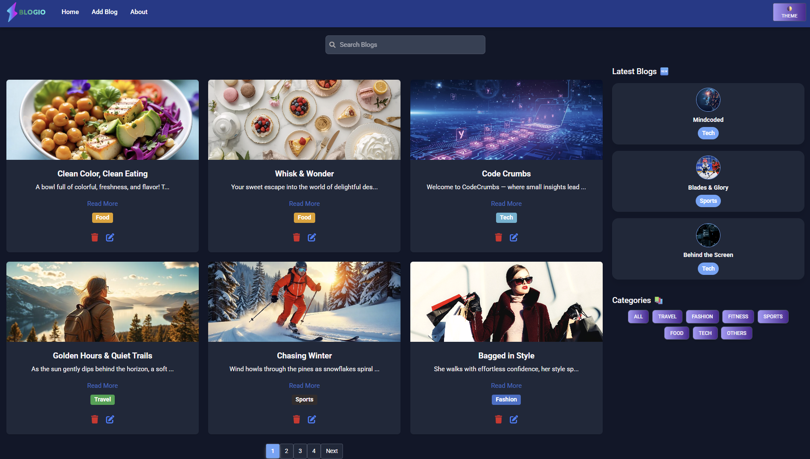

# Blogio - Modern React Blog Website ✨📰

A responsive blog website built with React, featuring:
- 🌙 Dark/Light theme toggle
- 🔎 Search & category filtering
- 🖼 Blog detail pages with images
- ⚡ JSON Server for backend simulation

## 🖼 Preview

## 🛠 Tech Stack

- React 18
- MDB React UI Kit
- React Router DOM
- Axios
- JSON Server
- React Toastify

## Features

- 🔥 Stylish dark/light theme toggle
- 🧠 Custom category filter + real-time search
- 📦 JSON Server integration for local data (acts as a mock backend)
- 📱 Fully responsive UI
- 💡 Built with React and MDBootstrap

> ⚠️ Note: This project uses [JSON Server](https://github.com/typicode/json-server) for simulating backend APIs locally. It does not connect to a real database.

## 📌 Author

Built by [Dharshini](https://github.com/dharshinisai6)
